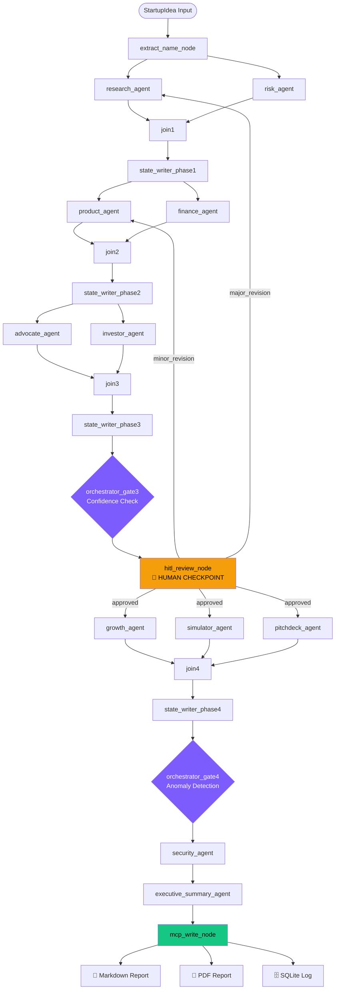

<div align="center">

# 🚀 Startup Copilot AI

### AI Operating System for Startup Founders

**Transform any startup idea into a complete investor-grade analysis package — in minutes.**

[](https://adk.dev/)
[](https://www.python.org/)
[](https://modelcontextprotocol.io/)
[](https://render.com/)
[](https://deepmind.google/technologies/gemini/)
[](https://www.sqlite.org/)
[](https://docs.astral.sh/uv/)
[](https://www.apache.org/licenses/LICENSE-2.0)

</div>

---

## 🌐 Live Demo

> **Try it now — no setup required.**

🔗 **[https://startup-copilot-ai-iyxy.onrender.com](https://startup-copilot-ai-iyxy.onrender.com)**

The live demo runs a full multi-agent startup analysis via a premium web dashboard. Enter any startup idea and watch 10 specialized AI agents deliver a complete due-diligence report in real time.

---

## 📂 GitHub Repository

🔗 **[https://github.com/Thilak-devx/startup-copilot-ai](https://github.com/Thilak-devx/startup-copilot-ai)**

---

## 📋 Table of Contents

- [🌐 Live Demo](#-live-demo)
- [🎯 Problem Statement](#-problem-statement)
- [💡 Project Overview](#-project-overview)
- [✨ Features](#-features)
- [🏗️ Architecture](#️-architecture)
- [🤖 Multi-Agent Workflow](#-multi-agent-workflow)
- [🔧 Google ADK Usage](#-google-adk-usage)
- [🔌 MCP Usage](#-mcp-model-context-protocol-usage)
- [🧠 Skills Usage](#-skills-usage)
- [🛠️ Technology Stack](#️-technology-stack)
- [📦 Installation](#-installation)
- [⚙️ Environment Variables](#️-environment-variables)
- [🏃 Running Locally](#-running-locally)
- [🚢 Deployment](#-deployment)
- [📁 Project Structure](#-project-structure)
- [🧪 Testing](#-testing)
- [📊 Sample Output](#-sample-output-solarex)
- [🔮 Future Improvements](#-future-improvements)
- [🤝 Contributing](#-contributing)

---

## 🎯 Problem Statement

Early-stage founders and investors face a fragmented, time-consuming due diligence process. A single startup idea requires:

- **Market research** across multiple sources
- **Risk assessment** across regulatory, legal, and operational dimensions
- **Financial modeling** with unit economics and 3-year projections
- **Product scoping** aligned with discovered market gaps
- **Investor-grade pitch decks** with slide-by-slide narrative
- **Growth strategy** with channel prioritization and 90-day roadmaps
- **Monte Carlo simulation** of realistic startup trajectories

Assembling all this typically takes weeks of analyst time, costs thousands of dollars, and requires expertise across multiple disciplines — putting it out of reach for most solo founders and early-stage teams.

---

## 💡 Project Overview

**Startup Copilot AI** is a fully automated, multi-agent analysis pipeline built on Google's Agent Development Kit (ADK). It accepts a structured startup idea (name, description, industry, target customer, pricing model, funding stage) and orchestrates a team of specialized AI agents to produce:

| Output | Description |
|---|---|
| 📊 **Market Research Report** | TAM/SAM/SOM sizing, competitor landscape, trend analysis |
| ⚠️ **Risk Assessment** | Regulatory, legal, operational and market risk matrix |
| 🏗️ **Product MVP Scope** | Prioritized feature list, user stories, tech stack recommendation |
| 💰 **Financial Model** | 3-year projections, unit economics, burn rate, break-even |
| 🔍 **Devil's Advocate Critique** | Stress-tested assumptions and failure mode analysis |
| 🏦 **Investor Readiness Score** | Weighted investment score (0–100) with VC-grade rationale |
| 📈 **Growth Strategy** | GTM channels, 90-day execution roadmap, Startup Score |
| 🎲 **12-Month Simulation** | Month-by-month user, revenue, and burn trajectory |
| 🎤 **10-Slide Pitch Deck** | Investor-ready markdown presentation |
| 🔒 **Security Checkpoint** | Content safety and policy compliance validation |
| 📝 **Executive Summary** | Board-level synthesis with overall confidence score |
| 📄 **PDF + Markdown Report** | Professional formatted deliverable saved to disk |
| 🗄️ **SQLite Run Log** | Persistent database entry for every analysis run |

---

## ✨ Features

- 🤖 **Collaborative multi-agent architecture** — 10 specialized LLM agents run in a structured DAG, each contributing unique domain expertise
- 🔗 **Cross-agent state propagation** — each agent reads prior agents' summaries from shared context, enabling genuine reasoning chains across phases
- ⚡ **Parallel execution** — agents within each phase run concurrently (Research + Risk → Product + Finance → Growth + Simulator + PitchDeck)
- 🤚 **Human-in-the-Loop (HITL) checkpoint** — workflow pauses mid-run for founder review; supports `approved`, `minor_revision`, and `major_revision` routing
- 🚦 **Orchestrator gates** — deterministic confidence scoring and anomaly detection at two workflow decision points
- 🔌 **MCP tool server** — custom Model Context Protocol server providing SQLite, filesystem, PDF generation, and market search tools
- 📚 **Skill-based knowledge injection** — six domain skills are auto-discovered and injected as LLM-accessible tools
- 📄 **PDF report generation** — fully formatted PDF with tables, headings, and pitch deck content via ReportLab
- 🏷️ **Structured Pydantic schemas** — every agent output is strongly typed; the schema enforces completeness and prevents hallucinated fields
- 🧪 **Fully testable without credentials** — `run_e2e_mock.py` validates the entire graph, state propagation, MCP writes, and artifact generation without any Google Cloud account
- 🌐 **Premium Web Dashboard** — React-style interactive UI with cinematic animations, real-time workflow visualization, and analytics charts

---

## 🏗️ Architecture



### Core Design Principles

| Principle | Implementation |
|---|---|
| **Separation of concerns** | Each agent owns exactly one domain; cross-agent communication is explicit via `ctx.state` |
| **Deterministic orchestration** | Gates use pure math (average confidence, threshold checks) — no LLM at decision points |
| **Schema enforcement** | Every agent output is validated by a Pydantic model before propagation |
| **Testability without credentials** | `run_e2e_mock.py` replaces all LLM agents with deterministic stubs |
| **Auditable state** | All `ctx.state` writes are handled by named StateWriter nodes |

---

## 🤖 Multi-Agent Workflow

The workflow executes in four phases, each separated by a JoinNode + StateWriter pair that persists outputs to shared session state.

### Phase 1 — Market Intelligence (Parallel)

| Agent | Role | Key Outputs |
|---|---|---|
| `research_agent` | Market Research Analyst | TAM/SAM/SOM, competitor profiles, market trends, opportunities |
| `risk_agent` | Risk Officer | Risk matrix (regulatory/legal/operational/market), showstopper flag |

### Phase 2 — Build Planning (Parallel, reads Phase 1)

| Agent | Role | Key Outputs |
|---|---|---|
| `product_agent` | Chief Product Officer | Prioritized MVP features, user stories, tech stack |
| `finance_agent` | CFO | 3-year projections, unit economics (LTV/CAC), cost structure |

### Phase 3 — Validation (Parallel, reads Phases 1+2)

| Agent | Role | Key Outputs |
|---|---|---|
| `advocate_agent` | Devil's Advocate | Stress tests, critical assumptions, failure scenarios |
| `investor_agent` | VC Partner | Investment readiness score (0–100), VC concerns, recommendation |

**→ Orchestrator Gate 3:** Checks average confidence across all 6 agents. Flags low scores and low investment readiness before routing to HITL.

**→ HITL Review Node:** Pauses execution. Founder can respond with:
- `approved` → proceeds to Phase 4
- `minor_revision` → loops back to `product_agent`
- `major_revision` → loops back to `research_agent`

### Phase 4 — Go-to-Market (Parallel, reads Phases 1–3)

| Agent | Role | Key Outputs |
|---|---|---|
| `growth_agent` | Growth Lead | GTM channels, acquisition strategy, 90-day roadmap, Startup Score |
| `simulator_agent` | Financial Modeler | 12-month simulation (users, MRR, burn, cash), success/failure scenarios |
| `pitchdeck_agent` | Pitch Specialist | 10-slide markdown pitch deck with full narrative |

**→ Orchestrator Gate 4:** Aggregates all 9 agent confidence scores. Detects score divergence anomalies (e.g. startup_score vs investment_readiness differing by >25 points).

**→ Security Agent:** Validates content safety and policy compliance across all generated outputs.

**→ Executive Summary Agent:** Synthesizes all phase outputs into a board-level executive brief with a weighted overall confidence score.

**→ MCP Write Node:** Calls the MCP server to write the Markdown report, generate the PDF, and insert a row into SQLite.

---

## 🔧 Google ADK Usage

This project demonstrates several advanced ADK patterns:

### `Workflow` — DAG Orchestration

```python
root_agent = Workflow(
    name="startup_copilot",
    edges=edges,           # full DAG definition
    input_schema=StartupIdea,
)
```

The `Workflow` class wires together `LlmAgent`, `FunctionNode`, and `JoinNode` components into a directed acyclic graph with conditional routing.

### `LlmAgent` — Specialized Agents

Each agent is an `LlmAgent` with a domain-specific instruction and output schema:

```python
research_agent = LlmAgent(
    name="research_agent",
    model=Gemini("gemini-2.5-flash"),
    instruction=RESEARCH_INSTRUCTION,   # callable for dynamic prompts
    output_schema=ResearchOutput,       # Pydantic model for structured output
    tools=[search_toolset, skill_toolset],
)
```

### `JoinNode` — Parallel Synchronization

```python
join1 = JoinNode(name="join1")
# Waits for both parallel agents, then passes combined dict downstream
((research_agent, risk_agent), join1)
(join1, state_writer_phase1)
```

### `FunctionNode` — Deterministic Logic

Used for extract, state writers, orchestrator gates, and MCP write:

```python
def state_writer_phase1(ctx: Context, node_input: Any) -> Event:
    return Event(
        output=node_input,
        state={
            "phase1_research_summary": _to_readable(research),
            "phase1_risk_summary": _to_readable(risk),
        }
    )
```

### Dynamic Instructions — Callable `instruction`

Agents in Phases 2–4 receive prior phase context at runtime:

```python
def PRODUCT_INSTRUCTION(ctx: Context) -> str:
    return _BASE.format(
        research_context=ctx.state.get("phase1_research_summary"),
        risk_context=ctx.state.get("phase1_risk_summary"),
    )
```

### HITL — `RequestInput` with Resume

```python
async def hitl_review_node(ctx, node_input) -> AsyncGenerator[RequestInput | Event, None]:
    if not ctx.resume_inputs or "founder_review" not in ctx.resume_inputs:
        yield RequestInput(interrupt_id="founder_review", message=summary)
        return
    # Parse response and emit routing decision
    yield Event(output={"status": status}, route=status)
```

### Conditional Routing

```python
(hitl_review_node, {
    "minor_revision": product_agent,
    "major_revision": research_agent,
    "approved":       (growth_agent, simulator_agent, pitchdeck_agent),
})
```

---

## 🔌 MCP (Model Context Protocol) Usage

The project ships a custom **FastMCP server** (`app/mcp_server.py`) that exposes five tools over stdio transport:

| Tool | Purpose | Used By |
|---|---|---|
| `search_market` | Returns market research data for a startup query | `research_agent` |
| `query_runs_db` | Read-only SQL queries against the SQLite database | `investor_agent` |
| `write_report_file` | Writes the Markdown report to `./outputs/` | `mcp_write_node` |
| `generate_pdf_report` | Converts Markdown to a styled PDF via ReportLab | `mcp_write_node` |
| `write_runs_db` | Inserts a full run record + orchestrator logs into SQLite | `mcp_write_node` |

### MCP Toolset Wiring

```python
# Each toolset opens a separate MCP subprocess connection with tool filtering
search_toolset = McpToolset(
    connection_params=StdioServerParameters(
        command=sys.executable, args=["app/mcp_server.py"]
    ),
    tool_filter=["search_market"],
)

sqlite_toolset = McpToolset(
    connection_params=StdioServerParameters(
        command=sys.executable, args=["app/mcp_server.py"]
    ),
    tool_filter=["query_runs_db"],
)
```

### MCP Write Node — Async Client Session

The final write node opens a direct MCP client session to call all three write tools sequentially:

```python
async with stdio_client(server_params) as (read, write):
    async with ClientSession(read, write) as session:
        await session.initialize()
        await session.call_tool("write_report_file", {"filename": ..., "content": ...})
        await session.call_tool("generate_pdf_report", {"markdown_path": ...})
        await session.call_tool("write_runs_db", {"session_id": ..., "startup_name": ..., ...})
```

---

## 🧠 Skills Usage

Skills are domain knowledge modules stored as `SKILL.md` files in `app/skills/`. They are auto-discovered at startup and injected into agents as a `SkillToolset`.

### Auto-Discovery

```python
# skill_loader.py
def build_skill_toolset() -> SkillToolset:
    skills = load_all_skills()   # walks app/skills/*, parses YAML frontmatter
    return SkillToolset(skills=skills)
```

Each `SKILL.md` has a YAML frontmatter with `name` and `description` (used by the LLM to decide when to invoke it), followed by detailed structured instructions in Markdown.

### Available Skills

| Skill | Triggers | Key Capability |
|---|---|---|
| `market-research` | Research agent analyzing market size or competitors | TAM/SAM/SOM framework, 5-step competitor mapping, trend analysis |
| `competitor-analysis` | Deep competitor profiling beyond basic research | 3-tier competitive landscape, feature matrix, moat scoring (1–5 scale) |
| `financial-modeling` | Finance agent building 3-year projections | Revenue model archetypes, burn rate, break-even, 3-scenario analysis |
| `investor-review` | Investor agent scoring funding readiness | Weighted 5-dimension scoring, LTV:CAC benchmarks, VC concern framework |
| `startup-scoring` | Growth/Advocate agent computing overall score | 5-dimension weighted rubric (market × MVP × unit econ × risk × growth) |
| `pitch-generator` | PitchDeck agent building 10-slide presentation | Slide-by-slide narrative structure, hook formulas, investor flow |

---

## 🛠️ Technology Stack

| Technology | Version | Role |
|---|---|---|
| [Google Agent Development Kit (ADK)](https://adk.dev/) | `>=2.0.0` | Multi-agent orchestration: Workflow, LlmAgent, JoinNode, FunctionNode, HITL |
| [Google Gemini](https://deepmind.google/technologies/gemini/) | `gemini-2.5-flash` | LLM powering all 10 specialized agents |
| [Model Context Protocol (MCP)](https://modelcontextprotocol.io/) | `>=0.1.0` | Tool server protocol for SQLite, filesystem, PDF, and search |
| [FastMCP](https://github.com/jlowin/fastmcp) | via `mcp` | MCP server framework with decorator-based tool registration |
| [FastAPI](https://fastapi.tiangolo.com/) | latest | REST API + static file server for the web dashboard |
| [Pydantic](https://docs.pydantic.dev/) | v2 | Structured, validated output schemas for all 10 agents (14 models) |
| [ReportLab](https://www.reportlab.com/) | `>=4.0.0` | Styled PDF generation from Markdown reports |
| [SQLite](https://www.sqlite.org/) | stdlib | Persistent run database with automated schema migration |
| [Uvicorn](https://www.uvicorn.org/) | latest | ASGI server for FastAPI in production |
| [uv](https://docs.astral.sh/uv/) | latest | Fast Python package and virtual environment manager |
| [Google Cloud Vertex AI](https://cloud.google.com/vertex-ai) | optional | Production LLM backend (alternative to Gemini API key) |
| [pytest](https://pytest.org/) | `>=9.0.2` | Unit and integration test runner |
| [ruff](https://docs.astral.sh/ruff/) | `>=0.4.6` | Fast Python linter and formatter |
| [Render](https://render.com/) | — | Cloud deployment platform (backend + frontend served together) |

---

## 📦 Installation

### Prerequisites

- **Python 3.11+**
- **[`uv`](https://docs.astral.sh/uv/getting-started/installation/)** package manager
- **Google Cloud SDK** or a `GOOGLE_API_KEY` (for live LLM runs only)

### 1. Clone the Repository

```bash
git clone https://github.com/Thilak-devx/startup-copilot-ai.git
cd startup-copilot-ai
```

### 2. Install Dependencies

```bash
uv sync
```

This creates a `.venv` and installs all dependencies from `uv.lock` — fully reproducible, no version drift.

---

## ⚙️ Environment Variables

Copy the provided template and fill in your values:

```bash
cp .env.example .env
```

`.env.example` contains:

```env
# Google Cloud / Vertex AI (for live Vertex AI runs)
GOOGLE_CLOUD_PROJECT=your-gcp-project-id
GOOGLE_CLOUD_LOCATION=global

# Google Gemini API Key (simpler alternative to Vertex AI)
GOOGLE_API_KEY=your-gemini-api-key-here

# Path to service account JSON (optional — leave blank for gcloud ADC)
GOOGLE_APPLICATION_CREDENTIALS=/path/to/service-account-key.json

# Controls Vertex AI vs. direct Gemini API routing
GOOGLE_GENAI_USE_VERTEXAI=False

# Port for the FastAPI server
APP_PORT=8080
```

> **No credentials needed for mock runs.** Use `run_e2e_mock.py` to validate the full workflow without any Google Cloud account.

---

## 🏃 Running Locally

### Option A — Full Run (Live Gemini / Vertex AI)

Runs the complete Solarex startup analysis with real Gemini model calls:

```bash
uv run python run_e2e.py
```

Outputs:
- `outputs/solarex_report.md`
- `outputs/solarex_report.pdf`
- A new row in `startup_copilot.db`

### Option B — Mock Run (No Credentials Required)

Validates the full workflow graph, state propagation, orchestration, and artifact generation using deterministic stubs:

```bash
uv run python run_e2e_mock.py
```

All 22 nodes execute, all artifacts are generated, and the final exit code is `0` on success.

### Option C — Web Dashboard

Start the FastAPI server and open the premium dashboard in your browser:

```bash
uv run python serve_frontend.py
# Dashboard available at http://localhost:8080
```

### Option D — Interactive Playground (ADK Web UI)

```bash
agents-cli playground
# Opens a web UI at http://localhost:8000
```

---

## 🚢 Deployment

The project is deployed as a **single Render Web Service**. FastAPI (`serve_frontend.py`) serves both the backend API endpoints and the static frontend files from the `frontend/` directory.

### Render Configuration

| Setting | Value |
|---|---|
| **Platform** | Render Web Service |
| **Runtime** | Python 3.11 |
| **Root Directory** | `.` (repo root) |
| **Build Command** | `pip install -e .` |
| **Start Command** | `uvicorn serve_frontend:app --host 0.0.0.0 --port $PORT` |

### Required Environment Variables on Render

Set these in the Render dashboard under **Environment → Environment Variables**:

| Variable | Description |
|---|---|
| `GOOGLE_API_KEY` | Your Gemini API key (use this unless you have Vertex AI set up) |
| `GOOGLE_GENAI_USE_VERTEXAI` | Set to `False` when using a Gemini API key |
| `GOOGLE_CLOUD_PROJECT` | *(Optional)* GCP project ID for Vertex AI |
| `GOOGLE_CLOUD_LOCATION` | *(Optional)* GCP region, e.g. `global` |

### Live URL

```
https://startup-copilot-ai-iyxy.onrender.com
```

---

## 📁 Project Structure

```
startup-copilot-ai/
│
├── app/                            # Core application package
│   ├── agent.py                    # Root agent: Workflow graph, edges, MCP toolsets
│   ├── agent_runtime_app.py        # Agent Runtime entry point
│   ├── mcp_server.py               # Custom FastMCP server (5 tools)
│   ├── orchestrator.py             # Phase 3 & 4 deterministic gate nodes
│   ├── schemas.py                  # All Pydantic I/O schemas (14 models)
│   ├── skill_loader.py             # Auto-discovers and loads SKILL.md files
│   ├── state_writers.py            # 5 StateWriter FunctionNodes
│   │
│   ├── nodes/                      # Per-agent instruction modules
│   │   ├── advocate.py             # Devil's Advocate (dynamic instruction)
│   │   ├── executive_summary.py    # Executive Summary (dynamic, reads all phases)
│   │   ├── finance.py              # Finance (dynamic instruction)
│   │   ├── growth.py               # Growth (dynamic instruction)
│   │   ├── investor.py             # Investor (dynamic instruction)
│   │   ├── pitchdeck.py            # PitchDeck (dynamic instruction)
│   │   ├── product.py              # Product (dynamic instruction)
│   │   ├── research.py             # Research instruction
│   │   ├── review.py               # HITL review node (async generator)
│   │   ├── risk.py                 # Risk instruction
│   │   ├── security.py             # Security (dynamic instruction)
│   │   └── simulator.py            # Simulator (dynamic instruction)
│   │
│   ├── app_utils/
│   │   ├── telemetry.py            # OpenTelemetry env config helper
│   │   └── typing.py               # Shared type aliases
│   │
│   └── skills/                     # Domain skill knowledge modules
│       ├── competitor_analysis/SKILL.md
│       ├── financial_modeling/SKILL.md
│       ├── investor_review/SKILL.md
│       ├── market_research/SKILL.md
│       ├── pitchdeck_generator/SKILL.md
│       └── startup_scoring/SKILL.md
│
├── frontend/                       # Static web dashboard
│   ├── index.html                  # Main dashboard (React-style SPA)
│   ├── analytics.html              # Analytics & charts page
│   ├── app.js                      # Interactive UI logic
│   └── styles.css                  # Premium design system
│
├── tests/
│   ├── unit/                       # Unit tests (schemas, skill loader, state writers)
│   ├── integration/                # Integration tests (workflow graph, node coverage)
│   └── eval/                       # ADK evaluation dataset and LLM-as-judge graders
│
├── deployment/
│   └── terraform/                  # Infrastructure-as-code for GCP deployment
│
├── outputs/                        # Generated reports (Markdown + PDF)  [git-ignored]
├── startup_copilot.db              # SQLite database of all analysis runs  [git-ignored]
│
├── serve_frontend.py               # FastAPI server — API + static file serving
├── run_e2e.py                      # Live end-to-end runner (real Gemini calls)
├── run_e2e_mock.py                 # Mock end-to-end runner (no credentials)
├── pyproject.toml                  # Project dependencies and tool config
├── uv.lock                         # Pinned dependency lockfile
├── .env.example                    # Environment variable template
├── agents-cli-manifest.yaml        # ADK CLI manifest
└── GEMINI.md                       # AI-assisted development guide
```

---

## 🧪 Testing

### Unit Tests

```bash
uv run pytest tests/unit -v
```

Covers: skill loader, Pydantic schema validation, state writer logic.

### Integration Tests

```bash
uv run pytest tests/integration -v
```

Covers: workflow graph construction, node wiring, full graph execution.

### Mock End-to-End

```bash
uv run python run_e2e_mock.py
```

Runs all 22 workflow nodes with deterministic stubs. Zero LLM calls required. Validates state propagation, MCP writes, PDF generation, and SQLite writes.

### Evaluation Suite (requires credentials)

```bash
agents-cli eval generate   # Run agent on eval dataset → produce traces
agents-cli eval grade      # LLM-as-judge grading on traces
agents-cli eval compare    # Regression diff between two grade runs
```

### Linting

```bash
uv run --with ruff ruff check app/ serve_frontend.py run_e2e.py run_e2e_mock.py tests/
uv run --with ruff ruff format app/ serve_frontend.py run_e2e.py run_e2e_mock.py tests/
```

---

## 📊 Sample Output: Solarex

**Input:**

```json
{
  "name": "Solarex",
  "description": "An AI-powered platform for optimizing community solar energy sharing.",
  "industry": "CleanTech",
  "target_customer": "Residential communities",
  "estimated_pricing": "10% transaction fee",
  "funding_stage": "Seed"
}
```

**Output excerpt from `outputs/solarex_report.md`:**

```markdown
# Startup Founder Package: Solarex

> Overall Confidence Score: 81/100
> Recommendation: Conditional Invest

## Key Scores

| Metric               | Score  |
|----------------------|--------|
| Startup Score        | 78/100 |
| Investment Readiness | 74/100 |
| Overall Confidence   | 81/100 |

## Top Strengths

- LTV:CAC of 8.5x via HOA channel — validated against Sunrun's $400 CAC benchmark
- No AI-native community solar competitor at scale — first-mover window open
- IRA regulatory tailwinds reduce customer acquisition friction
- HOA B2B2C model creates network effects hard for utilities to replicate quickly
```

**Artifacts generated on every run:**

| Artifact | Description |
|---|---|
| `outputs/solarex_report.md` | Full structured Markdown analysis (~5 KB) |
| `outputs/solarex_report.pdf` | Formatted PDF with tables and pitch deck (~8 KB) |
| `startup_copilot.db` | SQLite row with all scores, summary, and orchestrator logs |

---

## 🔮 Future Improvements

| Improvement | Description |
|---|---|
| **Real-time market data** | Replace mock `search_market` with live Google Search, Crunchbase, and Statista integrations |
| **Persistent sessions** | Replace `InMemorySessionService` with Cloud Firestore for resumable long-running workflows |
| **Founder revision loop UI** | Web-based HITL interface with inline commenting instead of CLI approval |
| **Multi-startup comparison** | Side-by-side analysis of multiple startup ideas using the SQLite run log |
| **Vector memory** | Store prior analyses in a vector database so agents can reference comparable startups |
| **Agent-level evaluation** | Per-agent LLM-as-judge grading using `agents-cli eval` for continuous quality tracking |
| **Email / Slack delivery** | Auto-deliver the PDF report via email or Slack webhook on workflow completion |
| **Sector-specific skills** | Domain skills for FinTech, HealthTech, B2B SaaS with sector-specific benchmarks |
| **Monte Carlo enhancements** | Simulator agent with configurable probability distributions and fan-out scenario trees |
| **Multi-language support** | Internationalized report generation for non-English markets |

---

## 🤝 Contributing

1. Fork the repository
2. Create a feature branch: `git checkout -b feature/my-improvement`
3. Make your changes and run `uv run pytest` and `uv run --with ruff ruff check .`
4. Open a pull request with a clear description of the change

---

<div align="center">

**Built with [Google Agent Development Kit](https://adk.dev/) &nbsp;·&nbsp; Powered by [Gemini](https://deepmind.google/technologies/gemini/) &nbsp;·&nbsp; Orchestrated via [MCP](https://modelcontextprotocol.io/) &nbsp;·&nbsp; Deployed on [Render](https://render.com/)**

</div>
